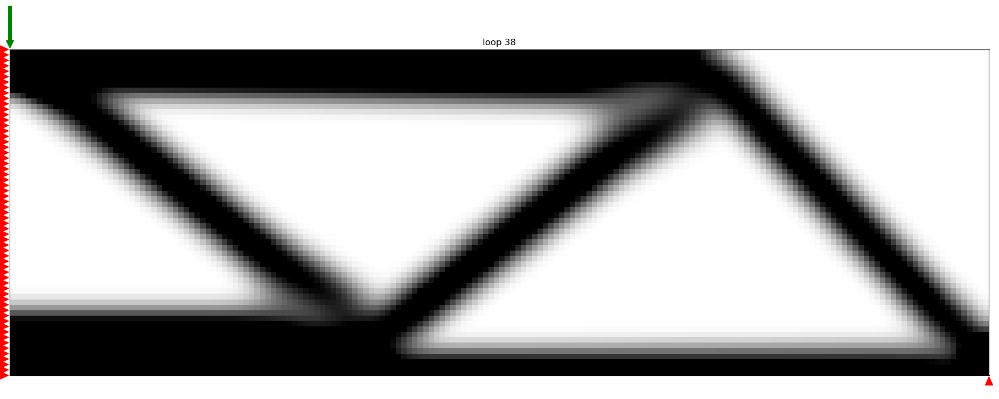

# Topology optimization #

This is an implementation of the [classic topology optimization code](http://www.topopt.dtu.dk/) described in [A 99 line topology optimization code written in Matlab](http://www.topopt.dtu.dk/files/matlab.pdf) by Ole Sigmund.
Start with [example.py](src/example.py).

## Prerequisites ##
Python 3 with NumPy, SciPy, matplotlib as the core. The imageio packege is required only when .gif figures are created. On Linux speed can be gained by installing scikit-umfpack with eider Intel mkl or OpenBlas support. To simplify the setup Anaconda enviroments (including Spyder) are avalible both for [Window](topopt/anaconda/TopOpt_Windows.yml) and [Linux](topopt/anaconda/TopOpt_Linux.yml). Some Windows enviroments could show an error at the `spsolve()` command in the FEM module, this error is related to umfpack, disabeling umfpack with `use_umfpack=False` as a keyword argument.

## Generating a new load class ##
The folowing section will explain how to set up a simulation for a new geometry. One is expected to have some knowlege of FEM and topology optimization. No explanation on the simplation settings, such as the resolution, filter size or volume constrain will follow. For information on those topics I recomend reading "Topology Optimization" from M.P. Bends&#248;e and O. Sigmund.

Making a new load class is fairly simple, make the following steps:
 1. Open the [loads.py](topopt/src/loads.py) file
 2. Copy the [HalfBeam class](https://github.com/AJJLagerweij/topopt/blob/1ef7adf60cc21a4467f51391ff65db5c5831ac3a/src/loads.py#L82-L97) to the botom of the file and change the name of the class.
 3. Change the boundery conditions e.g. the load vector and fix certern degrees of freedom (fixdofs). The folowing section wil show how to do it for an example problem.
 4. Change the passive elements defenition, those that do not change in desity, for example with a density of 0.0001 as a hole is planned there.

To allow the load vector and fixdofs to change with your mesh size it is important to formulate it as equations of the amount of elements in x and y direction. The nodes are numbered from the top left corner and go down to the botom before starting on the next column of nodes. Funciton [nodes](https://github.com/AJJLagerweij/topopt/blob/1ef7adf60cc21a4467f51391ff65db5c5831ac3a/src/loads.py#L27) can helps with finding the nodal coodinates of point as a function of the number of elements in x and y direction. Take the HalfBeam example which among others is fixed in the y direction at the botom end of the beam. Then using `n1, n2, n3, n4 = self.nodes(self.nelx-1, self.nely-1, self.nelx, self.nely)` returns the nodal coordinates of the element at position nelx-1, nely-1. (the -1 is used as python starts counting from 0) The position of `n1` is in the top left the others are defined in clockwise order. Thus the botom right node, which is the one we need, is `n3`. To convert the nodal position to the position of the x orientation of the node in the displacement or load vector simply multiply by the dimensions used (`self.dim`). For the location of the y orientation simply add `+1` to the x location.

Sometimes a wole side is fixed (due to a wall or symetry) than using the `range(start, stop, step)` can be usefull. Take for exapmle the HalfBeam again. At the left side all movement in x direction is constrained due to symetry. As it is known that ranging numbers from 0 (the top left node its x orientation) to the botom of the last element (`self.dim*(self.nely+1)`) with steps of `self.dim` (2 in the 2D case) contains all the locations in the displacement vector that need to be fixed. Thus the code `[x for x in range(0, self.dim*(self.nely+1), self.dim)]` retuns a list with all these locations.

The [passive](https://github.com/AJJLagerweij/topopt/blob/3a2151347c33862189570372e7c5d87ba67c086d/src/loads.py#L100-L104) elements defenition is fairly simple, three list (or arrays) need to be exported, elx contains the x coordinates of the fixed element, ely the y coordinates and lastly the values list contains the value at the given coordinate. The order of the elements should be the same in all three lists.

## To be implemented ##
Currently two changes are proposed before the final release of the 2D software.
 1. Adding a fast multigrid cholesky decomposition solver
 2. Adding a MMA algorithm for better convergence

## Special Thanks To ##
 1. Ole Sigmund and Martin Bends&#248;e from the Technical University of Denmark for there contributions to the field of topology optimization
 2. Li-Yi Wei from the University of Hong Kong for making a beautiful [python code](https://github.com/1iyiwei/topopt)
