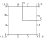
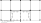

.. _`Fatigue Life Explanation`:

Fatigue Crack Growth Life Maximization
======================================
The objective of the research was to explore how topology optimization can be used to optimized for damage tolerance objectives such as fatigue crack growth life (FCGL).
It was hypothesized that the difficulties would lay in the formulation an objective function and the adjoint equation.
There formulation should be based upon linear fracture mechanics combining the Paris rule and FEA.

.. contents::
   :local:
   :depth: 1

Continuum formulation
---------------------
The problem formulation, required for optimization problems, should contain the optimization objective, its link to the design variables and the constraints.

   Design domain :math:`\Omega` with a crack, arbitrary boundary conditions and a density :math:`X` which is dependent on the position vector :math:`\boldsymbol{x}`.

Because the goal is design a geometry with the most crack growth cycles and uses the Paris-Erdogan rule :math:`da/dN = C K_I^m` [1]_.
Due to this formulation the design geometry, is the optimization objective was formulated as an integral, :math:`N = \int 1/(da/dN) da`.
This integral is only valid in the socalled Paris region, hence the integral starts at :math:`a_0>0` and ends it ends at a chosen maximum length :math:`a_{\text{end}}`.
This :math:`a_{\text{end}}` should be a crack length that can be observed during inspection while it is not long enougth for failure.
Assuming a general problem, shown in :numref:`Problem_FCGL`, which maximized the FCGL by changing the material distribution, :math:`X(\boldsymbol{x})` within the design domain :math:`\Omega`, the following mathematical formulation is proposed,

.. math::

   \min_{X(\boldsymbol{x})} \;\;& N(X(\boldsymbol{x})) = \displaystyle\int_{a_0}^{a_{\text{end}}} \frac{1}{C}\frac{1}{K_I(X(\boldsymbol{x}),a)}^m \text{d}a\\
   &\begin{array}{llll}
   \text{s.t. :} & a(\boldsymbol{u}(X(\boldsymbol{x})),\hat{\boldsymbol{u}}) = l(\hat{\boldsymbol{u}}) \\
   & \displaystyle\int_{\Omega} X(\boldsymbol{x}) \text{ d}\Omega \; = \; \text{ Vol}(\Omega^m) \; \leq \; V \\
   & X_{\min} \leq X(\boldsymbol{x}) \leq X_{\max}
   \end{array}

it enforces equilibrium with a virtual work method while the problem is subjected to a resource constraint.
This constraint limits the volume within the design domain that can be filled with a material beside setting a minimum and maximum density value.

For any optimization a link between the objective and the design variables must be made.
The method proposed here can be used for two cases, variable thickness plate and discrete material distribution.
The honeycomb infill problem is a type of discrete material distribution and will not be discussed separately.
In the first case the optimization variables :math:`X` are interpreted as the local plate thickness.
As the thickness influences the local stiffness properties it affects the stress intensity values at the crack tip, these stress intensity factors are related to the crack growth rate.
Hence the thickness does influece the amount of load cycles required for the crack to grow from math:`a_0` to math:`a_{\text{end}`.
For this variable thickness sheet a linear relation,

.. math::

   \boldsymbol{E}_{ijkl}(\boldsymbol{x}) = \boldsymbol{E}_{ijkl, \min} + X(\boldsymbol{x})\left(\boldsymbol{\overline{E}}_{ijkl} - \boldsymbol{E}_{ijkl, \min}\right) 

between local stiffness and thickness is used.
This equation was proposed by M.P. Rossow and J.E. Taylor [2]_ and discussed by O. Sigmund [3]_, and causes the stiffness to become twice as high when the thickness is doubled.
Here :math:`\boldsymbol{\overline{E}}_{ijkl}` is a constant stiffness tensor related to the material it unity thickness while :math:`\boldsymbol{E}_{ijkl, \min}` a tensor is with very small stiffness.
Which enforces the total stiffness to be larger than zero.
One cannot allow the stiffness to become zero as it would cause the FEA to fail.
This relation might be inaccurate due to out of plane effects at thickness changes and it will be necessary to measure under what circumstances this equation is invalid.

When the goal is to obtain a discrete design the density values can be either :math:`0` (no material) or :math:`1` (material).
This however causes the objective equation to become discrete as well as the method used a gradient approach and requires a continuous function of density.
To ensure a discrete final design while maintaining a continuous objective function a penalization method was implemented.
The method used was based upon the penalized proportional stiffness method (SIMP), 

.. math::
	
   \boldsymbol{E}_{ijkl}(\boldsymbol{x}) = \boldsymbol{E}_{ijkl, \min} + X(\boldsymbol{x})^p\left(\boldsymbol{\overline{E}}_{ijkl} - \boldsymbol{E}_{ijkl, \min}\right) 

it causes designs to converge to a :math:`0`-:math:`1` solution when the penalty factor :math:`p` is chosen sufficiently high. Values of :math:`p\geq 3` are required for designs to become discrete.

Discretisation
--------------
The previous section linked the design variables to the stiffness distribution no official formulation of the FCGL in terms of design variables was made.
This formulation is indirectly made through the equilibrium constraint as stiffness distribution influences the stress/displacement field of the loaded part, these stress/displacement distribution can be related to the stress intensity factor and the fatigue crack growth rate.
The original equilibrium equation is in a continuum formulation but to simplify the problem a discretized version will be solved using FEA.

To calculate the FCGL one has to use the Paris rule resulting in:

.. math::

   N(X(\boldsymbol{x})) = \displaystyle\int_{a_0}^{a_{\text{end}}} \frac{1}{C}\frac{1}{K_I(X(\boldsymbol{x}), a)}^m \text{d}a

:math:`K_I` is dependend on the design variables :math:`X(\boldsymbol{x})`, both :math:`C` and :math:`m` can be interpetated as material constants.
Notice that :math:`K_I` is also depending on the actual crack length (:math:`a`), hence the integral is replaced by the following discrete summation,

.. math::

   N(X(\boldsymbol{x}))  = \frac{1}{C}\sum_{l=1}^{L-1} \dfrac{(a_{l+1} + a_l)}{\left( \dfrac{1}{2}\left(K_I(X(\boldsymbol{x}), a_{l+1}) + K_I(X(\boldsymbol{x}), a_{l})\right)\right)^m}

to compute this summation :math:`L` different values for :math:`K_I` have to be computed each with a different crack length.
To ensure a direct and efficient calculation of the stress intensity factor while using a finite element analysis an enrichment method was used for elements close to the crack tip.
The method used was developed by S.E. Benzley [4]_ and improved by L.N. Gifford [5]_.
It uses a linear summation of a continuous displacement field and a near crack tip displacement field capturing both the discrete behavior at the crack tip and the continuous one around it.
The discrete solution was derived with the Westergaard function method [6]_.
This type of tip element enrichment allows accurate predictions of stress intensity directly from the FEA without any post processing as it can be found in the displacement vector.

Crack tip element
^^^^^^^^^^^^^^^^^
The method uses special elements around the crack tip of which the stiffness matrix needs to be derived.
As these enriched elements based upon an addition of the continuous and singularity displacement field these are discussed separately at first.

   Nodal definition of the crack tip element.

The enrichment method shown here was based upon the crack tip element developed my L.N. Gifford [5]_.
Who based the enriched elements on a bicubic serendipity elements, see :numref:`ElementDef_FCGL`.
The algorithm presented here keeps the local coordinate system :math:`(\xi,\, \eta)` as only a regular mesh with square elements will be used.
For a more general element that can contain cracks under an angle and that transforms elements from :math:`(\xi,\, \eta)` to :math:`(x,\, y)` see the original paper [5]_.

The displacement field within the bicubic serendipity 12-node element can be described by:

.. math::

   \boldsymbol{u} = \sum_{i=0}^{11} N^i(\xi,\, \eta)\boldsymbol{u}^i

where the shape functions :math:`N^i` are,

.. math::

   &N^0 = \frac{1}{32}\left(1 - \eta\right) \left(1 - \xi\right) \left(9 \eta^{2} + 9 \xi^{2} - 10\right)\\
   &N^1 = \frac{9}{32}\left(1 - \eta\right) \left(1 - 3 \xi\right) \left(1 - \xi^{2}\right) \\
   &N^2 = \frac{9}{32}\left(1 - \eta\right) \left(1 + 3 \xi\right) \left(1 - \xi^{2}\right)\\
   &N^3 = \frac{1}{32}\left(1 - \eta\right) \left(1 + \xi\right) \left(9 \eta^{2} + 9 \xi^{2} - 10\right) \\
   &N^4 = \frac{9}{32}\left(1 - 3 \eta\right) \left(1 + \xi\right) \left(1 - \eta^{2}\right) \\
   &N^5 = \frac{9}{32}\left(1 + 3 \eta\right) \left(1 + \xi\right) \left(1 - \eta^{2}\right) \\
   &N^6 = \frac{1}{32}\left(1 + \eta\right) \left(1 + \xi\right) \left(9 \eta^{2} + 9 \xi^{2} - 10\right)\\
   &N^7 = \frac{9}{32}\left(1 + \eta\right) \left(1 + 3 \xi\right) \left(1 - \xi^{2}\right) \\
   &N^8 = \frac{9}{32}\left(1 + \eta\right) \left(1 - 3 \xi\right) \left(1 - \xi^{2}\right) \\
   &N^9 = \frac{1}{32}\left(1 + \eta\right) \left(1 - \xi\right) \left(9 \eta^{2} + 9 \xi^{2} - 10\right)\\
   &N^{10} = \frac{9}{32}\left(1 + 3 \eta\right) \left(1 - \xi\right) \left(1 - \eta^{2}\right)\\
   &N^{11} = \frac{9}{32}\left(1 - 3 \eta\right) \left(1 - \xi\right) \left(1 - \eta^{2}\right)

Added to this will be the crack tip singularity displacement field which derivation starts from the definition of stress intensity factors in a simplified 2D space,

.. math::

   K_I = \lim\limits_{r \rightarrow 0} \sqrt{2\pi r} \sigma_{xx}\\
   K_{II} = \lim\limits_{r \rightarrow 0} \sqrt{2\pi r} \sigma_{xy}

and the crack tip stresses derived with the Westergaard method [6]_,

.. math::

   \sigma_{xx} = & \frac{K_I}{\sqrt{2\pi r}}\cos\frac{\theta}{2}\left( 1 - \sin\frac{\theta}{2}\sin\frac{3\theta}{2}\right) \\
   &- \frac{K_{II}}{\sqrt{2\pi r}}\sin\frac{\theta}{2}\left(2 + \cos\frac{\theta}{2}\cos\frac{3\theta}{2}\right)\\
   \sigma_{yy} =& \frac{K_I}{\sqrt{2\pi r}}\cos\frac{\theta}{2}\left( 1 + \sin\frac{\theta}{2}\sin\frac{3\theta}{2}\right) \\
   &+ \frac{K_{II}}{\sqrt{2\pi r}}\cos\frac{\theta}{2}\sin\frac{\theta}{2}\cos\frac{3\theta}{2}\\
   \tau_{xy} = & \frac{K_I}{\sqrt{2\pi r}}\cos\frac{\theta}{2}\sin\frac{\theta}{2}\cos\frac{3\theta}{2} \\
   &+ \frac{K_{II}}{\sqrt{2\pi r}} \cos\frac{\theta}{2}\left(1 - \sin\frac{\theta}{2}\sin\frac{3\theta}{2}\right)

which are accurate approximations of the stresses close to the crack tip, i.e. :math:`r` is small. :numref:`CrackTip_FCGL` shows the axis system definition for the calculation around the crack tip.

   Definition of the axis systems around the crack tip.

A formulation of the displacement field can be found by integration leading to,

.. math::

   u_x =& K_I f_x(r,\, \theta) + K_{II} g_x(r,\, \theta) \\
   =& \frac{K_I}{4G}\sqrt{\frac{r}{2\pi}} \left(-1 + \gamma -2\sin^2\frac{\theta}{2}\right)\cos\frac{\theta}{2}\\
   &+ \frac{K_{II}}{4G}\sqrt{\frac{r}{2\pi}}\left(1 + \gamma + 2\cos^2\frac{\theta}{2}\right)\sin\frac{\theta}{2}\\
   u_y =& K_I f_y(r,\, \theta) + K_{II} g_y(r,\, \theta) \\
   =& \frac{K_I}{4G}\sqrt{\frac{r}{2\pi}}\left(1 + \gamma +2\cos^2\frac{\theta}{2} \right)\sin\frac{\theta}{2} \\
   &+ \frac{K_{II}}{4G}\sqrt{\frac{r}{2\pi}}\left(1 - \gamma +2\sin^2\frac{\theta}{2}\right)\cos\frac{\theta}{2}

where :math:`\gamma = (3-\nu)/(1+\nu)` for plane stress and :math:`\gamma = 3-4\nu` for plane strain [7]_.
When assuming linear fracture mechanics one can describe the displacement field of this element as summation of the continuums and the singularity displacement fields resulting in:

.. math::

   u_x = K_I f_x(r,\, \theta) + K_{II}g_x(r,\, \theta) + \sum N^i(\xi,\, \eta)u_x^i \\
   u_y = K_I f_y(r,\, \theta) + K_{II}g_y(r,\, \theta) + \sum N^i(\xi,\, \eta)u_y^i

The singularity equations need to be transformed from the :math:`(r,\, \theta)` axis into the local :math:`(\xi,\, \eta)` system.
This transformation is dependent of the relative location of the crack tip to the local element axis system.

The enriched displacement functions can cause discontinuities at the border to normal elements, this can be repaired by multiplying the enrichment terms of the displacement function with an equation that is 1 at the crack tip and 0 at the border to non enriched elements [4]_.
It has however been reported that the effects of discontinuities are minor and this solution was therefore not implemented [5]_.

Following a definition of FE by Zienkiewicz [8]_ an element stiffness matrix can be calculated with,

.. math::

   \boldsymbol{K} = \int_{-1}^{1}\int_{-1}^{1} \boldsymbol{B}^T\boldsymbol{DB}\; \det\boldsymbol{J} \;\; \text{d}\xi \text{d}\eta

where :math:`\boldsymbol{D}` the material stiffness matrix is, :math:`\boldsymbol{J}` the Jacobian of axis system transformation :math:`(\xi,\, \eta)` into the global :math:`(x,\, y)` axis system is and :math:`\boldsymbol{B}` the matrix is that converts displacement into strain.
The integration was performed with a Gauss-Legendre quadrature function with 8x8 integration points as was found sufficient by L.N. Gifford [5]_.

For a standard bicubic serendipity element this :math:`\boldsymbol{B}` matrix is of shape :math:`(3,\, 24)` however due to the enrichment it becomes :math:`(3,\, 26)`.
Which results in a final stiffness matrix of :math:`(26,\, 26)`. Where

.. math::

   \boldsymbol{f} = \boldsymbol{K}\boldsymbol{u} = \begin{pmatrix}
   f_x^0\\
   \vdots\\
   f^*_x\\
   f^*_y
   \end{pmatrix} = 
   \begin{bmatrix}
   \boldsymbol{k} & \vdots & \boldsymbol{k}_{12}\\
   \dotsm & \vdots & \dotsm \\
   \boldsymbol{k}_{21} & \vdots & \boldsymbol{k}_{22}
   \end{bmatrix}
   \begin{pmatrix}
   u_x^0\\
   \vdots\\
   K_I\\
   K_{II}
   \end{pmatrix}

Here :math:`\boldsymbol{k}` is similar to the stiffness matrix of a normal bicubic element, the enrichment is in the parts :math:`\boldsymbol{k}_{12}`, :math:`\boldsymbol{k}_{21}` and :math:`\boldsymbol{k}_{22}`.
New terms do also appear in the force vector, where :math:`f^*_x` and :math:`f^*_y` are so-called singular loads.
They describe the external forces applied on the crack boundary [4]_, in general these values are zero.

Meshing strategy
^^^^^^^^^^^^^^^^

To reduce computational costs these enriched elements are only used at the crack tip and conventional linear elements are used throughout the rest of the mesh.
It uses the hanging node method to connect the elements as can be seen in :numref:`Meshing_FCGL`.

   Top section of mesh around a crack tip, :math:`\oplus` is the enrichment node with :math:`K_I` and :math:`K_{II}`, while solid circles represent the linear ones and the open circle the higher order ones.

This mesh is not conform which can potentially cause the displacement field to become discontinuous.
To avoid this one could use normal bicubic serendipity elements throughout the entire mesh which is computational inefficient.
However, using a multi-resolution interpretation of topology optimization its performance might be improved [9]_.

Currently the linear system of the FEA, :math:`\boldsymbol{f} = \boldsymbol{Ku}`, and the adjoint equation, :math:`\boldsymbol{l} = \boldsymbol{K\lambda}`, are solved with a complete Cholesky decomposition.
A more efficient methods can be formulated with a Multi Grid Conjugate Gradient method as proposed by O. Amir [10]_.

Objective formulation
^^^^^^^^^^^^^^^^^^^^^
As a spacial discretized method (FEA) was used to calculate the objective the problem formulation needs to become discretized as well.
For a mesh of :math:`N` elements the optimization objective becomes;

.. math::

   &\max_{X_1, X_2, \dots, X_N} \;\; N = \frac{1}{C}\sum_{l=1}^{L-1} \dfrac{(a_{l+1} + a_l)}{\left( \dfrac{1}{2}\left(K_I(a_{l+1}) + K_I(a_{l})\right)\right)^m}\\
   &\hspace{0.75cm}\begin{array}{llll}
   \text{s.t. :} & \boldsymbol{Ku} = \boldsymbol{f} \\
   & \displaystyle\sum^N_{e=1} v_eX_e \; \leq \; V \\
   & X_{\min} \leq X_e \leq X_{\max} \;\; \forall \;\; e \in \{1, 2, \dots, N\}\\
   \text{where :} & \boldsymbol{K} = \displaystyle\sum_{e=1}^{N}\boldsymbol{K}_e(X_e, \overline{E})\\
   & K_I(a_{l}) = K_I^l = \left(\boldsymbol{l}^l \right)^T \boldsymbol{u}^l
   \end{array}

which maximized the FCGL while ensuring equilibrium and setting constraints to the density distribution.
Here :math:`\boldsymbol{u}` is the enriched displacement vector, :math:`f` the force vector and :math:`v_e` is the (relative) element volume.
:math:`\boldsymbol{l}` is zero vector except for the degree of freedom linked to the stress intensity factor, and the multiplication of :math:`\boldsymbol{l}^T\boldsymbol{u}` will return the stress intensity factor at one crack length.
This is similar to the compliant mechanism optimization mentioned by O. Sigmund [11]_ where the displacement of a specific degree of freedom is maximized.

This formulation of the objective can not be combined with Method of Moving Asymptotes because MMA requires the derivatives of the objective function and constraints to have the same order of magnitude.
Hence the obective function is scaled linearly to be in the same order as the density constraint, this resulted in the discrete objective:

.. math::

   &\max_{X_1, X_2, \dots, X_N} \;\; O = \frac{1}{m2^m \sum_{l=1}^{L-1}(a_{l+1} + a_l)}\sum_{l=1}^{L-1} \dfrac{(a_{l+1} + a_l)}{\left( \dfrac{1}{2}\left(K_I(a_{l+1}) + K_I(a_{l})\right)\right)^m}\\
   &\hspace{0.75cm}\begin{array}{llll}
   \text{s.t. :} & \boldsymbol{Ku} = \boldsymbol{f} \\
   & \displaystyle\sum^N_{e=1} v_eX_e \; \leq \; V \\
   & X_{\min} \leq X_e \leq X_{\max} \;\; \forall \;\; e \in \{1, 2, \dots, N\}\\
   \text{where :} & \boldsymbol{K} = \displaystyle\sum_{e=1}^{N}\boldsymbol{K}_e(X_e, \overline{E})\\
   & K_I(a_{l}) = K_I^l = \left(\boldsymbol{l}^l \right)^T \boldsymbol{u}^l
   \end{array}

Sensitivity Analysis
--------------------
The local convex approximation requires the calculation of the sensitivity of :math:`O` to a density change in any element.
Because :math:`K_I` is the only thing dependend on the design variables the objective gradient is formulated as a function of :math:`\partial K_I / \partial X_e`.

.. math::

   \frac{\partial O}{\partial X_e} = -\frac{1}{\sum_{l=1}^{L-1} (a_{l+1} + a_l)}\:\:\displaystyle{\sum}_{l=1}^{L-1} \dfrac{\;\; (a_{l+1} + a_l)\; \left(\dfrac{\partial K_I(a_{l+1})}{\partial X_e} + \dfrac{\partial K_I(a_{l})}{\partial X_e}\right)}{\left(K_I(a_{l+1}) + K_I(a_{l})\right)^{m+1}} 

:math:`\partial K_I(a_{l}) / \partial X_e` has to be calculated for all crack lengths.
The derivative derivation for a specific crack length starts with adding a zero term after the known function :math:`K_I = \boldsymbol{l}^T\boldsymbol{u}`, where :math:`\boldsymbol{\lambda}` is an arbitrary vector:

.. math::

   K_I = \boldsymbol{l}^T\boldsymbol{u} - \boldsymbol{\lambda}^T\left(\boldsymbol{Ku} - \boldsymbol{f}\right)

.. math::

   \frac{\partial K_I}{\partial X_e} = \left(\boldsymbol{l}^T-\boldsymbol{\lambda}^T\boldsymbol{K} \right)\frac{\partial \boldsymbol{u}}{\partial X_e} - \boldsymbol{\lambda}^T\frac{\partial \boldsymbol{K}}{\partial X_e}\boldsymbol{u}

Now choosing a convenient vector for :math:`\boldsymbol{\lambda}` which causes :math:`\boldsymbol{l}^T-\boldsymbol{\lambda}^T\boldsymbol{K}` to be zero leads to the following expression for the sensitivity,

.. math::

   \frac{\partial K_I}{\partial X_e} =& - \boldsymbol{\lambda}^T\frac{\partial \boldsymbol{K}}{\partial X_e}\boldsymbol{u}&\\
   & \text{where:} \hspace{1cm} \boldsymbol{l} = \boldsymbol{K\lambda}

This means that :math:`\boldsymbol{\lambda}` can be calculated with the FEA, where :math:`\boldsymbol{l}` is seen as a sort force vector, by solving :math:`\boldsymbol{l} = \boldsymbol{Ku}`.
The sensitivity of :math:`\boldsymbol{K}` to the element density can be calculated, resulting in the following gradient:

.. math::

   \frac{\partial K_I}{\partial X_e} = - pX_e^{p-1}\boldsymbol{\lambda}^T\boldsymbol{K}_e\boldsymbol{u}

Computational implementation
----------------------------
The iterative implementation of topology optimization as proposed by M. Beckers, [8]_ or M.P. Bendsøe and O. Sigmund [2]_ are similar.
It exists out of three parts, initialization, optimization and post processing.
The flowchart of the local compliance algorithm can be found in :numref:`Flowchart_FL`.

   Flowchart for maximum fatigue crack growth life [7]_.

In the initialization phase the problem is set up.
It defines the design domain, the loading conditions, the initial design and generates the finite element mesh that will be used in the optimization phase.

The optimization phase is the iterative method that solves the topology problem.
It will analyze the current design with multiple FEA, for each crack length increment one.
After which it will calculate the sensitivity of the stress intensity factor to the density of each element, for each crack length increments.
Then the over all performance and sensitivity is calculate, this is used in the local approximation and update scheme which is discussed in :ref:`Sensitivity_and_MMA`.
The Method of Moving Asymptotes (MMA), developed by K. Svanberg [9]_, is used to formulate a simplified convex approximation of the problem which is optimized to formulate the updated design.
These steps are performed in a loop until the design is converged, i.e. when the change in design between two iterations becomes negligible.

Post processing is required to remove the last elements with intermediate values and generate a shape out of the design, for example a CAD or STL file.
This algorithm will not contain any of the post processing steps.
The code used in this communication simply plots the final shape and load case.

Limitations
^^^^^^^^^^^
The limitations of the fatigue crack growth life maximization are inherited from the stress intensity minimization one.
Two of these limitations are discussed again, as they have more impact on this FCGL maximization than they had on the SIF minimization.

That the thickness of crack tip elements cannot be changed is a significant problem for fatigue life maximization of variable thickness plates.
The fatigue crack growth analysis requires the crack to propagate.
In the fatigue maximization all elements around the crack are forced to have unit thickness.
Literature shows that creating patterns of varying thickness/stiffness in front and after the crack tip influences the crack growth rate and the overall fatigue live [11]_, [12]_.
These kinds of crenelation patterns cannot be created by the optimization algorithm.

That the crack geometry needs to be determined in advance does also have a larger impact in this crack growth life maximization algorithm.
The fatigue life optimization assumes a crack path and does not consider that the crack might deviate from it.
It might very well be possible that a better design, one in which more load cycles are required for the crack to grow a certain length, can be obtained by \enquote{crack steering}.
It is recommended to investigate how the method can be expanded such that crack steering becomes possible.

Computational efficiency
^^^^^^^^^^^^^^^^^^^^^^^^
In this thesis little attention was payed to the computational efficiency, stress intensity minimization was fast enough to run on a simple laptop anyway.
This is different for fatigue life maximization.
The difference in computational requirements comes from the fact that information of the stress intensity and its sensitivity are required as a function of crack length.
The fatigue growth model requires calculating stress intensity factors for the crack at different values of :math:`a`.
For each stress intensity calculation a mesh needs to be generated on which a FEA and adjoint problem will be solved.

In the current, simple but inefficient, implementation the following steps are taken:

 - During the problem initialization the meshes for the crack at all lengths are generated.
 - During each iteration the following steps are performed for all these meshes:

   - Assemble the stiffness matrix.
   - Solve both the linear elastic and adjoint problems with a complete Cholesky factorization, which has a computational complexity of :math:`O(n^3/3)`.

All meshes are generated ones and reused throughout all iterations, which compared to regenerating them, reduces the computational requirements.
This causes an increase of the memory requirements, because all the meshes generated need to be saved untill they are used.
The size of all these arrays becomes significant.
Take for example a problem with a mesh of 500 by 240 elements, each mesh required 0.3 GB memory to store.
For fatigue life maximization many of these meshes need to be saved.
For an optimization with a crack that growths from element 220 to 430 around 210 crack length increments are required, just saving the meshes requires 63 GB of RAM already.

No attempt to improve the mesh generation and saving was made because the current implementation is incompatible with any method that allows for crack steering.
When the crack path can be changed by the optimization variables, the mesh of the current crack increment can only be determined after finishing the FEA calculation of the previous increment.
This means that the mesh can only be generated in each increment.

Besides the memory requirement, the optimization requires a large computational effort as it needs to solve two systems of linear equations per crack length considered.
For a mesh of 500 by 240 elements every iteration required around 13 minutes on a pc with a Intel Xeon E5-1620 v2.
The optimization required 12 days to converge, this is significantly longer than the 4 to 8 hours which is used in stress intensity minimization at the same resolution.
To reduce both the memory and computational requirements one could use a crack increment that are larger than one element between every stress intensity calculation.
Performing the calculation every two elements will already half the memory and computational requirements.

Taking crack length increments that are far greater than the element size will result in inaccurate fatigue life predictions which has a large effect on the optimization results.
An optimization with large increments will design a structure that preforms well at the location where the stress intensity factors are calculated and neglect the rest.
\Cref{fig:increments_geometry} the result of an optimization with a crack increment of 25 elements is shown.
A more accurate FEA with used crack increments of 1 element was run.
The area under the :math:`dN/da` curves in \cref{fig:inaccuracy dN/da} of the smaller crack increments is lower.
This proves that taking to large increments will lead to degenerate designs of with performance is overestimated by the optimization.
From experience a crack increment of two elements can always be used without any artifacts appearing.
This is also why the lines shown in \cref{fig:StressIntensity_FL,fig:crack_growth,fig:Cycles} are generated by calculating the stress intensity values every two elements.

Improving the computational efficiency should be a major focus before expanding the capabilities to higher resolution or 3D problems.
One could consider improving the currently algorithm by using efficient FE problem solvers [13]_ and creating a parallel implementation [14]_ with for example the PETSc framework\footnote{Look for an example at \href{http://www.topopt.mek.dtu.dk/Apps-and-software/Large-scale-topology-optimization-code-using-PETSc}{TopOpt\_in\_PETSc} or [15]_}.
Another solution to reduce the computational requirement is to reduce the amount of FEA that need to be performed, for example by replacing them with more simple algebraic approximations.
B. Herremans showed that an algebraic approximation of the fatigue performance could replace the FE model used in optimization algorithm, wile retaining accuracy.
The original model (developed by J. Lu [11]_) was to slow for high resolution problem, while the improved version could be run in a matter of seconds [16]_.

Exaples and results
-------------------

References
----------
.. [1]  P. C. Paris and F. Erdogan, “`A Critical Analysis of Crack Propagation Laws <https://www.doi.org/10.1115/1.3656900>`_,” J. Basic Eng., vol. 85, no. 4, p. 528, 1963.
.. [2]  M. P. Rossow and J. E. Taylor, “`A Finite Element Method for the Optimal Design of Variable Thickness Sheets <https://www.doi.org/10.2514/3.50631>`_,” AIAA J., vol. 11, no. 11, pp. 1566–1569, Nov. 1973.
.. [3]  O. Sigmund, N. Aage, and E. Andreassen, “`On the (non-)optimality of Michell structures <https://www.doi.org/10.1007/s00158-016-1420-7>`_,” Struct. Multidiscip. Optim., vol. 54, no. 2, pp. 361–373, 2016.
.. [4]  S. E. Benzley, “`Representation of singularities with isoparametric finite elements <https://www.doi.org/10.1002/nme.1620080310>`_,” Int. J. Numer. Methods Eng., vol. 8, no. 3, pp. 537–545, 1974.
.. [5]  L. Nash Gifford and P. D. Hilton, “`Stress intensity factors by enriched finite elements <https://www.doi.org/10.1016/0013-7944(78)90059-0>`_,” Eng. Fract. Mech., vol. 10, no. 3, pp. 485–496, Jan. 1978.
.. [6]  H. M. Westergaard, “Bearing pressures and cracks,” J. Appl. Mech., vol. 6, pp. A49-53, 1939.
.. [7]  A. F. Bower, “Modeling Material Failure,” in Applied Mechanics of Solids, 1st ed., Baton Rouge (LA): CRC Press, 2009, pp. 569.
.. [8]  O. C. Zienkiewicz, The Finite Element Method In Engineering Science. New York (NY): McGraw-Hill, 1971.
.. [9]  J. P. Groen, M. Langelaar, O. Sigmund, and M. Ruess, “`Higher-order multi-resolution topology optimization using the finite cell method <https://www.doi.org/10.1002/nme.5432>`_,” Int. J. Numer. Methods Eng., vol. 110, no. 10, pp. 903–920, Jun. 2017.
.. [10]  O. Amir, N. Aage, and B. S. Lazarov, “`On multigrid-CG for efficient topology optimization <https://www.doi.org/10.1007/s00158-013-1015-5>`_,” Struct. Multidiscip. Optim., vol. 49, no. 5, pp. 815–829, May 2014.
.. [11]  J. Lu, N. Kashaev, and N. Huber, “`Crenellation Patterns for Fatigue Crack Retardation in Fuselage Panels Optimized via Genetic Algorithm <https://www.doi.org/10.1016/j.proeng.2015.08.065>`_,” Procedia Eng., vol. 114, pp. 248–254, 2016.
.. [12]  C. D. Rans, R. Rodi, and R. Alderliesten, “`Analytical prediction of mode I stress intensity factors for cracked panels containing bonded stiffeners <https://www.doi.org/10.1016/j.engfracmech.2012.11.001>`_,” Eng. Fract. Mech., vol. 97, no. 1, pp. 12–29, 2012.
.. [13]  O. Amir, N. Aage, and B. S. Lazarov, “`On multigrid-CG for efficient topology optimization <https://www.doi.org/10.1007/s00158-013-1015-5>`_,” Struct. Multidiscip. Optim., vol. 49, no. 5, pp. 815–829, May 2014.
.. [14]  N. Aage and B. S. Lazarov, “`Parallel framework for topology optimization using the method of moving asymptotes <https://www.doi.org/10.1007/s00158-012-0869-2>`_,” Struct. Multidiscip. Optim., vol. 47, no. 4, pp. 493–505, Apr. 2013.
.. [15]  N. Aage, E. Andreassen, and B. S. Lazarov, “`Topology optimization using PETSc: An easy-to-use, fully parallel, open source topology optimization framework <https://www.doi.org/10.1007/s00158-014-1157-0>`_,” Struct. Multidiscip. Optim., vol. 51, no. 3, pp. 565–572, Mar. 2015.
.. [16]  B. Herremans, “Thickness distribution optimisation in flat panels for damage tolerance using genetic algorithms,” Technical University of Delft, 2019.
