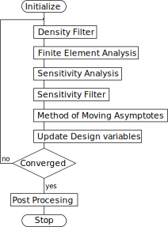

.. _`Global Compliance Minimization Explanation`:

Global Compliance Minimization
==============================

This type of TO tries to minimize the global compliance.
It will be the main example algorithm as it has been researched and documented extensively among others by the TopOpt group at the Technical University of Denmark (DTU) [1]_, [2]_, [3]_, [4]_, [5]_, [6]_.
The goal of the method is to minimize the compliance by distributing the assigned mass. It has to satisfy certain constraints, the volume constrain :math:`V` limits the amount of mass available and the structure should be in equilibrium.

.. contents::
   :local:
   :depth: 1

Continuum Formulation
---------------------
The linear elastic optimization for small deformation as presented by N. Olhoff and J.E. Taylor [7]_ is used.
It considers a design region :math:`\Omega` that is in :math:`\boldsymbol{\!R}^2` or :math:`\boldsymbol{\!R}^3` of which a subregion :math:`\Omega^m` is filled with material [1]_.
The optimal topology is reached when the optimal stiffness tensor :math:`\boldsymbol{E}_{ijkl}(\boldsymbol{x})` is found.

As all space within :math:`\Omega^m` is filled an equation of the mass distribution :math:`X` can be formulated as a discrete function,

.. math::

   X(\boldsymbol{x}) = \;\; \begin{cases} 1 \qquad \text{ if } \;\; \boldsymbol{x} \; \in \; \Omega^m \\ 0 \qquad \text{ if } \;\; \boldsymbol{x} \; \in \; \Omega\backslash\Omega^m \end{cases}

This can be used to define the stiffness tensor,

.. math::

   \boldsymbol{E}_{ijkl}(\boldsymbol{x}) = X(\boldsymbol{x})\boldsymbol{\overline{E}}_{ijkl}

in terms of this mass distribution function and the constant rigidity tensor :math:`\boldsymbol{\overline{E}}_{ijkl}`.
The constant rigidity tensor is function of the material properties only.
As :math:`X` is a discrete function all admissible tensors are discrete and thus the optimization problem has a discrete valued parameter function.

The amount of work due of the deformation :math:`\boldsymbol{u}` can be calculated by \cref{eq:LinLoad}.
With the standard linearized strain formulation this results in,

.. math::

   l(\boldsymbol{u}) = \int_{\Omega}\boldsymbol{fu}\text{ d}\Omega + \int_{\Gamma_T} \boldsymbol{tu} \text{ d}\Gamma_T

A bi-linear energy equation with virtual work :math:`a(\boldsymbol{u},\hat{\boldsymbol{u}})` is formulated,

.. math::

   a(\boldsymbol{u},\hat{\boldsymbol{u}}) =\int_{\Omega} \boldsymbol{E}_{ijkl}\boldsymbol{\varepsilon}_{kl}(\boldsymbol{u})\boldsymbol{\varepsilon}_{ij}(\hat{\boldsymbol{u}})\text{ d}\Omega

:math:`\hat{\boldsymbol{u}}` is an arbitrary kinematically admissible deformation.
Equilibrium is ensured when :math:`l(\hat{\boldsymbol{u}}) = a(\boldsymbol{u}, \hat{\boldsymbol{u}})` is satisfied for all admissible deformations :math:`\hat{\boldsymbol{u}}`.

As minimizing the work, due to the traction forces for a given load, minimizes the deformation of a structure the problem can be formulated as:

.. math::

    \min_{\Omega^m} \;\;& l(\boldsymbol{u}) \\
    &\begin{array}{llll}
    \text{s.t. :} & a(\boldsymbol{u},\hat{\boldsymbol{u}}) = l(\hat{\boldsymbol{u}}) \\
    & \int_{\Omega} X(\boldsymbol{x}) \text{d}\Omega \; = \; \text{ Vol}(\Omega^m) \; \leq \; V
    \end{array}

Discretization
---------------
To solve the continuum problem of the previous section it is discretized into a finite element analysis with :math:`N` elements:

.. math::

   \min_{X_1, X_2, \dots, X_N} \;\: & c = \boldsymbol{f}^T \boldsymbol{u}\\
   &\hspace{-0.6cm}\begin{array}{llll}
   \text{s.t. :} & \boldsymbol{Ku} = \boldsymbol{f} \\
   & \displaystyle\sum^N_{e=1} v_eX_e \; \leq \; V \\
   & X_e \in \{0, 1\} \;\;\; \forall \;\;\; e \in \{1, 2, \dots, N\}\\
   \text{where :} & \boldsymbol{K} = \displaystyle\sum_{e=1}^{N}\boldsymbol{K}_e(X_e, \overline{E})
   \end{array}

it shows that the element stiffness matrix :math:`\boldsymbol{K_e}` depends on the element material value :math:`X_e` and the material stiffness :math:`\overline{E}`.
The problem becomes unstable towards the element type and mesh when the discrete formulation of \cref{eq:conti mass distribution,eq:stiffness_Lit} are used.
Such a distribution problem generally has no solution [8]_, [9]_. Iterative search methods would not work because they require the calculation of gradients.
Therefore, the problem is changed so that the density becomes a continuous equation ranging from 0 to 1.

.. math::

   0 \leq X_e \leq 1

This method would result in a design with intermediate values.
Although this makes sense for variable thickness plate design, see the work of M.P. Rossow and J.E. Taylor [10]_, for discrete topology design loses its direct physical representation.
There is either material or there is not, intermediate values are meaningless.
Changing \cref{eq:stiffness_Lit} with a penalization that reduces the effectiveness of intermediate values results in a formulation that suppresses these intermediate values.
The method used here, developed by E. Andreassen [5]_, is derived from the classical penalized proportional stiffness method (SIMP) [1]_, [3]_.
Here :math:`E_{\min}` is a small artificial stiffness used to avoid elements with zero stiffness as that could make the FEA unstable.

.. math::

   \boldsymbol{E}_{ijkl}(\boldsymbol{x}) = \boldsymbol{E}_{ijkl, \min} + X(\boldsymbol{x})^p\left(\boldsymbol{\overline{E}}_{ijkl} - \boldsymbol{E}_{ijkl, \min}\right)

When :math:`p > 1` the intermediate density values are less effective as there stiffness is low in comparison to the volume occupied. When :math:`p` is sufficiently large, generally :math:`p\geq3`, the design converges to a solution that is close to a discrete (0-1) design.

Sensitivity analysis
--------------------
The gradient of one element in the discretized form is :math:`\partial c/\partial X_e`.
This derivative does not have to be explicitly calculated as the problem is self adjoint.
This is used by  the following proof. It starts with a new formulation of the work, the difference is the zero term at the end.
Again :math:`\hat{\boldsymbol{u}}` is any arbitrary admissible deformation [3]_.

.. math::

   c = \boldsymbol{f}^T \boldsymbol{u} - \hat{\boldsymbol{u}}^T\left( \boldsymbol{Ku} - \boldsymbol{f} \right)

taking the derivative to the density leads to:

.. math::

   \frac{\partial c}{\partial X_e} = \left( \boldsymbol{f}^T - \hat{\boldsymbol{u}}^T\boldsymbol{K} \right) \frac{\partial \boldsymbol{u}}{\partial X_e} - \hat{\boldsymbol{u}}^T \frac{\partial\boldsymbol{K}}{\partial X_e}\boldsymbol{u}

when :math:`\hat{\boldsymbol{u}}` satisfies the adjoint equation it becomes:

.. math::

   \frac{\partial c}{\partial X_e} = & - \hat{\boldsymbol{u}}^T	\frac{\partial\boldsymbol{K}}{\partial X_e}\boldsymbol{u} \\
   & \text{when} \hspace{0.5cm} \boldsymbol{f}^T - \hat{\boldsymbol{u}}^T\boldsymbol{K} = 0

Satisfying this adjoint equation is simple, just choose :math:`\hat{\boldsymbol{u}} = \boldsymbol{u}`.
The derivative of the stiffness matrix to the density of an element can be derived leading to the final expression of the gradient:

.. math::

   \frac{\partial c}{\partial X_e} = - pX_e^{p-1}\boldsymbol{u}^T\boldsymbol{K}_e\boldsymbol{u}

Computational Implementation
----------------------------
The iterative implementation of topology optimization as proposed by M. Beckers, [11]_ or M.P. Bendsøe and O. Sigmund [3]_ are similar.
It exists out of three parts, initialization, optimization and post processing.
The flowchart for the methods used in this algorithm can be found in :numref:`Flowchart_stiffness`.

   Basic flowchart for compliance minimization [3]_.

In the initialization phase the problem is set up.
It defines the design domain, the loading conditions, the initial design and generates the finite element mesh that will be used in the optimization phase.

The optimization phase is the iterative method that solves the topology problem.
It will analyze the current design with a FEA. After which it will calculate the sensitivity of the global compliance to the density of each element, this is the local gradient of which the calculation is discussed in :ref:`Sensitivity_and_MMA`.
The Method of Moving Asymptotes (MMA), developed by K. Svanberg [12]_, is used to formulate a simplified convex approximation of the problem which is optimized to formulate the updated design.
These steps are performed in a loop until the design is converged, i.e. when the change in design between two iterations becomes negligible.

Post processing is required to remove the last elements with intermediate values and generate a shape out of the design, for example a CAD or STL file.
This algorithm will not contain any of the post processing steps.
The code used in this communication simply plots the final shape and load case.

Example and Results
-------------------
**Example code and results!!!!!!!!!!!!!!!!!**

References
----------

.. [1]  M. P. Bendsøe, “`Optimal shape design as a material distribution problem <https://www.doi.org/10.1007/BF01650949>`_,” Struct. Optim., vol. 1, no. 4, pp. 193–202, Dec. 1989.
.. [2]  O. Sigmund, “`A 99 line topology optimization code written in matlab <https://www.doi.org/10.1007/s001580050176>`_,” Struct. Multidiscip. Optim., vol. 21, no. 2, pp. 120–127, 2001.
.. [3]  M. P. Bendsøe and O. Sigmund, `Topology Optimization <https://www.doi.org/10.1007/978-3-662-05086-6>`_. Berlin, Heidelberg: Springer Berlin Heidelberg, 2004.
.. [4]  B. S. Lazarov and O. Sigmund, “`Filters in topology optimization based on Helmholtz-type differential equations <https://www.doi.org/10.1002/nme.3072>`_,” Int. J. Numer. Methods Eng., vol. 86, no. 6, pp. 765–781, May 2011.
.. [5]  E. Andreassen, A. Clausen, M. Schevenels, B. S. Lazarov, and O. Sigmund, “`Efficient topology optimization in MATLAB using 88 lines of code <https://www.doi.org/10.1007/s00158-010-0594-7>`_,” Struct. Multidiscip. Optim., vol. 43, no. 1, pp. 1–16, Jan. 2011.
.. [6]  J. Wu, N. Aage, R. Westermann, and O. Sigmund, “`Infill Optimization for Additive Manufacturing—Approaching Bone-Like Porous Structures <https://www.doi.org/10.1109/TVCG.2017.2655523>`_,” IEEE Trans. Vis. Comput. Graph., vol. 24, no. 2, pp. 1127–1140, Feb. 2018.
.. [7]  N. Olhoff and J. E. Taylor, “`On Structural Optimization <https://www.doi.org/10.1115/1.3167196>`_,” J. Appl. Mech., vol. 50, no. 4b, p. 1139, 1983.
.. [8]  G. Strang and R. V. Kohn, “`Optimal design in elasticity and plasticity <https://www.doi.org/10.1002/nme.1620220113>`_,” Int. J. Numer. Methods Eng., vol. 22, no. 1, pp. 183–188, Jan. 1986.
.. [9]  R. V. Kohn and G. Strang, “`Optimal design and relaxation of variational problems, I <https://www.doi.org/10.1002/nme.1620220113>`_,” Commun. Pure Appl. Math., vol. 39, no. 1, pp. 113–137, 1986.
.. [10]  M. P. Rossow and J. E. Taylor, “`A Finite Element Method for the Optimal Design of Variable Thickness Sheets <https://www.doi.org/10.2514/3.50631>`_,” AIAA J., vol. 11, no. 11, pp. 1566–1569, Nov. 1973.
.. [11]  M. Beckers, “`Topology optimization using a dual method with discrete variables <https://www.doi.org/10.1007/BF01197709>`_,” Struct. Optim., vol. 17, no. 1, pp. 14–24, Feb. 1999.
.. [12]  K. Svanberg, “`The method of moving asymptotes - a new method for structural optimization <https://www.doi.org/10.1002/nme.1620240207>`_,” Int. J. Numer. Methods Eng., vol. 24, no. 2, pp. 359–373, Feb. 1987.

